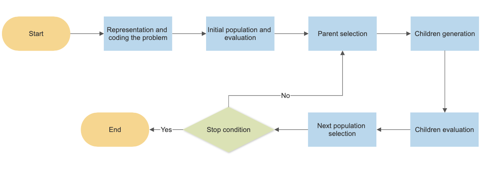

# Introduction
In this repository I tried to solve two optimization problems using evolutionary algorithms. 
The problems are [knapsack ptoblem](https://en.wikipedia.org/wiki/Knapsack_problem) and [traveling salesman](https://en.wikipedia.org/wiki/Travelling_salesman_problem).

## Evolutionary Algorithm
These are the fixed steps in an evolutionary algorithm 
1.define the representation 
2.initiate the population 
3.parent selection 
4.children generation 
5.children evaluation 
6.next generation selection 
7.check the stop condition, if not met repeat from step 3  

## Structure
The first structure idea that pops to my and any one else's mind is using inheritance and that looks more appropriate 
but the goal of this code is to get familiar with evolution and some algorithms frequently used in this field so to  
show these objectives better I decided to have a class that just shows the evolution process and another class that 
has the implementations of the algorithms I mentioned

## knapsack problem representation 
I think binary representation can be a good choice, the length of the chromosomes is equal to the number of weights, 
each gene in the chromosome shows if its corresponding weight is selected or not by being zero or one.